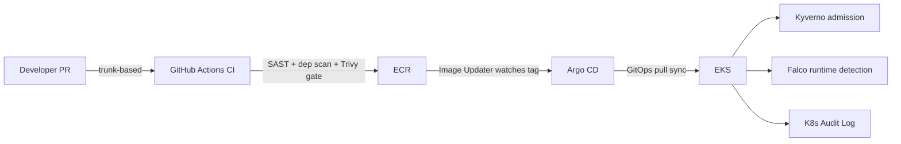

# Day 80 — Phase 2 Project: Load Testing & Documentation

**Phase:** 2 – CI/CD & Security | **Week:** W13 | **Domain:** Review | **Flag:** 📌

## Brief

A pipeline that deploys successfully but has never been load tested only proves it can handle a demo — it says nothing about whether it holds up under real traffic, whether autoscaling actually kicks in fast enough, or whether the security tooling from Day 79 adds meaningful overhead. And a project that isn't documented well enough for a stranger to understand and reproduce is, from a hiring manager's perspective, functionally the same as a project that doesn't exist — they will not dig through your commit history to reconstruct your reasoning. Today's second half is about proving the pipeline works under load and making sure the evidence of that is actually legible to someone evaluating it in ninety seconds, echoing the portfolio-audit discipline from Day 60 but applied to this specific capstone.

## Load testing the deployed app

**k6** (Grafana Labs) is a strong default choice: scriptable in JavaScript, runs from the command line or in CI, and produces the exact percentile-based metrics that matter for a real SLO conversation (not just an average, which hides tail latency).

```javascript
// loadtest.js
import http from 'k6/http';
import { check, sleep } from 'k6';

export const options = {
  stages: [
    { duration: '30s', target: 20 },   // ramp up to 20 VUs
    { duration: '2m', target: 20 },    // hold steady
    { duration: '30s', target: 100 },  // spike to 100 VUs
    { duration: '2m', target: 100 },   // hold under spike load
    { duration: '30s', target: 0 },    // ramp down
  ],
  thresholds: {
    http_req_duration: ['p(95)<500', 'p(99)<1000'],  // fail the run if SLO is breached
    http_req_failed: ['rate<0.01'],
  },
};

export default function () {
  const res = http.get('https://app.example.com/api/health');
  check(res, { 'status is 200': (r) => r.status === 200 });
  sleep(1);
}
```

```bash
k6 run loadtest.js
```

The `thresholds` block is doing real work here — it turns the load test into a pass/fail gate (useful as an outer-loop CI job per Day 78's inner/outer loop distinction) instead of just a number someone has to eyeball and judge subjectively.

**What to actually watch and record while the test runs**, not just the k6 summary output at the end:
- `kubectl get hpa -w` — does the HorizontalPodAutoscaler actually scale out in response to the spike stage, and how many seconds does that take from load increase to new pod Ready? This lag is a real, reportable number.
- `kubectl top pods` — resource usage per pod during the spike; anything approaching its configured limits is a signal your resource requests/limits need revisiting.
- `kubectl get pods -w` for any `OOMKilled` or `CrashLoopBackOff` events during the spike — a real finding, worth writing up honestly rather than hiding.
- Whether Falco (from Day 79) or the seccomp/AppArmor profiles introduce any measurable latency overhead under load — genuinely worth measuring once (run the same test with Falco's DaemonSet paused vs. running, if you want a rigorous before/after) rather than assuming security tooling is free.

**Locust** is a reasonable alternative if you're more comfortable in Python — same core idea (scripted virtual users, ramping load, percentile metrics), different language and a web UI by default instead of k6's CLI-first approach. Either is a legitimate choice; what matters for the portfolio is that you ran it, captured real numbers, and can explain what you saw.

## Documentation that actually gets read

The README structure that reliably survives a hiring manager's ~90-second first pass (directly reusing the audit discipline from Day 60, now applied to a from-scratch capstone rather than a retrofit):

1. **One-paragraph overview** — what this is, in plain language, before any architecture detail.
2. **Architecture diagram** — see below; this is the single highest-value section to get right.
3. **Tech stack table** — a scannable list (GitHub Actions, Trivy, cosign, ECR, Argo CD, EKS, Kyverno, Falco, k6), not prose.
4. **Security controls summary** — a table mapping each pipeline stage to its enforced control(s), directly reflecting the previous README's four-layer model (shift-left / build-time / admission-time / runtime).
5. **How to run/reproduce it** — exact commands, not "set up the usual tools."
6. **Load test results** — the actual numbers from your k6 run (p95/p99 latency, error rate, HPA scale-out time), not just "it performed well."
7. **A real tradeoff or problem you hit** — per Day 60's portfolio-audit guidance, this is the single highest-signal section; something like "Argo CD Image Updater initially polled ECR too infrequently for the demo, so I added a webhook-triggered sync instead of relying purely on polling" is concrete, credible evidence of debugging, not just execution.
8. **Future improvements** — an honest, short list; this signals ongoing engineering judgment rather than treating the project as "finished forever."

**Architecture diagrams**: GitHub renders **Mermaid** code blocks natively inside a Markdown README — no external image, no broken-link risk, and it's trivially version-controlled as text:

````markdown

````

For a more polished, presentation-quality diagram (e.g., for a LinkedIn post accompanying the project), Excalidraw or draw.io export to SVG/PNG are reasonable choices — but the Mermaid block should exist regardless, because it renders directly in the repo itself with zero extra steps for a reader.

## Points to Remember

- A load test with only an average latency number is much weaker evidence than one reporting p95/p99 — tail latency is what actually determines whether real users have a bad experience, and averages hide it.
- Setting explicit `thresholds` in a k6 script turns a load test into an automatable pass/fail gate, not just a number someone has to interpret after the fact.
- Watching HPA scale-out time, resource usage, and any `OOMKilled`/`CrashLoopBackOff` events *during* the test is more valuable than the final summary alone — that's where the actually interesting findings live.
- A Mermaid diagram embedded directly in the README renders natively on GitHub with no external dependency — always include one, even if you also produce a nicer exported image elsewhere.
- The single highest-signal documentation section is a specific, honestly-described tradeoff or problem you hit and how you resolved it — this is what separates "followed a tutorial" from "made engineering decisions" in a reviewer's eyes.

## Common Mistakes

- Running a load test once, glancing at "requests succeeded: 100%," and calling it done — without checking p95/p99 latency or whether autoscaling actually kept pace, a test can look clean while still hiding a real problem under the surface.
- Writing a README that lists what was built without ever stating why a particular choice was made or what tradeoff was considered — the single most common way a capstone project reads as copied rather than reasoned through.
- Skipping the architecture diagram entirely, or linking to an external image host that can silently break — a Mermaid block committed as text in the README avoids both problems.
- Load testing against a shared, non-representative environment (e.g., a tiny dev cluster with 1/10th the resources of what "production" would have) and reporting the numbers as if they generalize, without noting that caveat explicitly.
- Treating documentation as an afterthought written in the last ten minutes — for this specific capstone, the documentation *is* the primary artifact a reviewer will actually read; under-investing here undersells everything built in the first README.
