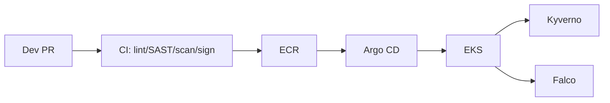

# Day 80 — Cheatsheet: Phase 2 Project — Full Pipeline

## Pipeline stage -> tool -> enforcement mechanism

```
Lint/test          npm test / pytest              needs: chain, non-zero exit fails job
SAST                Semgrep (p/owasp-top-ten)       non-zero exit fails job
Dependency scan     audit-ci / Snyk / pip-audit      non-zero exit fails job
Secret scan         gitleaks                         non-zero exit fails job / push protection
Image build+scan    docker build + Trivy             exit-code: '1' on CRITICAL,HIGH
SBOM                syft <image> -o cyclonedx-json   artifact, not a gate itself
Image signing       cosign sign --key env://KEY       required by admission verifyImages
Registry            ECR                               scan-on-push, immutable tags
GitOps deploy       Argo CD                            selfHeal reverts manual drift
Admission control    Kyverno / OPA Gatekeeper          validationFailureAction: Enforce
Pod hardening       seccomp/AppArmor/capabilities      Day 79 controls, enforced via policy
Runtime detection   Falco                              DaemonSet, alerts on live behavior
Forensic record     K8s audit log                      pods/exec at RequestResponse level
```

## CI job gating (GitHub Actions)

```yaml
jobs:
  scan:
    steps:
      - uses: aquasecurity/trivy-action@master
        with:
          severity: CRITICAL,HIGH
          exit-code: '1'          # <- this line is the actual enforcement
  build:
    needs: [scan]                 # <- this is the actual gate
```

## cosign / syft

```bash
cosign generate-key-pair
cosign sign --key cosign.key <image>
cosign verify --key cosign.pub <image>

syft <image> -o cyclonedx-json > sbom.json
syft <image> -o table              # human-readable
```

## Argo CD

```bash
argocd app create my-app \
  --repo https://github.com/you/app-manifests \
  --path overlays/production \
  --dest-server https://kubernetes.default.svc \
  --dest-namespace production \
  --sync-policy automated --self-heal

argocd app sync my-app
argocd app history my-app
```

## Kyverno

```bash
kyverno apply policies/ --resource pod.yaml    # dry-run test a policy
kubectl get clusterpolicy
kubectl describe clusterpolicy require-signed-images
```

## k6 load test

```bash
k6 run loadtest.js
k6 run --out json=results.json loadtest.js
```

```javascript
options.thresholds = {
  http_req_duration: ['p(95)<500', 'p(99)<1000'],
  http_req_failed: ['rate<0.01'],
};
```

```bash
# watch while the test runs
kubectl get hpa -w
kubectl top pods
kubectl get pods -w   # watch for OOMKilled / CrashLoopBackOff
```

## Mermaid diagram (renders natively on GitHub)

````markdown

````

## README structure checklist

```
[ ] One-paragraph overview
[ ] Mermaid architecture diagram
[ ] Tech stack table
[ ] Security controls table (stage -> control)
[ ] How to run/reproduce (exact commands)
[ ] Load test results (real p95/p99 numbers)
[ ] One real tradeoff/problem you hit
[ ] Future improvements
```
